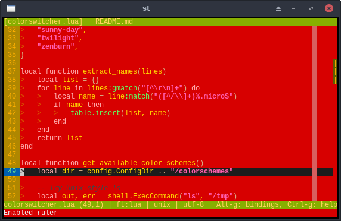
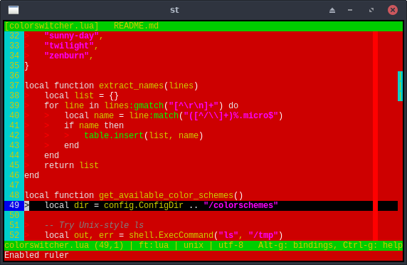

# Kareha Colors Plugin for Micro

A seasonal color scheme plugin for the
[micro](https://micro-editor.github.io/) text editor.

This plugin provides a warm, autumn-themed color scheme named `kareha`,
designed to evoke the feeling of fallen leaves and the late-year atmosphere.


kareha (256 colors)


kareha-16 (16 colors)

See [help/karehacolors.md](help/karehacolors.md) for more details.

## Installation

### Option 1: Install as a plugin

Place the plugin folder in `~/.config/micro/plug/karehacolors/`, or clone it
directly from the GitHub repository:

```sh
mkdir -p ~/.config/micro/plug
git clone https://github.com/akikareha/micro-kareha-colorschemes ~/.config/micro/plug/karehacolors
```

Then restart micro and run:

```
set colorscheme kareha
set colorscheme kareha-16
```

Alternatively, this plugin is also available through the unofficial plugin
channel:  
https://github.com/akikareha/micro-unofficial-plugin-channel  
You can install it by adding the channel and then using `plugin install`.

### Option 2: Use the colorscheme files only

If you prefer not to install the entire plugin, you can copy the color scheme
files directly:

```sh
mkdir -p ~/.config/micro/colorschemes
cp colorschemes/kareha.micro ~/.config/micro/colorschemes/
cp colorschemes/kareha-16.micro ~/.config/micro/colorschemes/
```

Then set the colorscheme as usual:

```
set colorscheme kareha
set colorscheme kareha-16
```

This will work even without installing the plugin.

## License

MIT.

## Author

Aki Kareha (aki@kareha.org)
